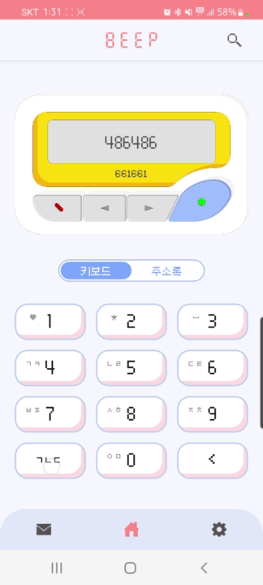
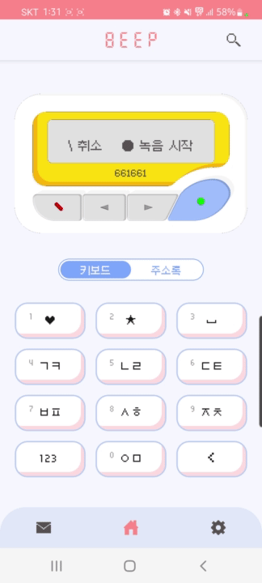
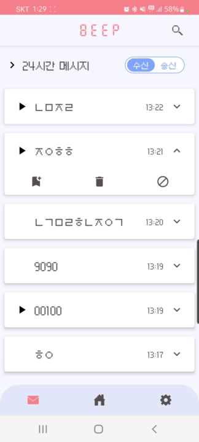
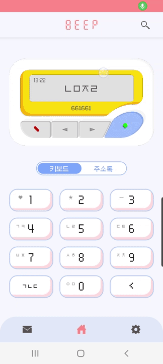
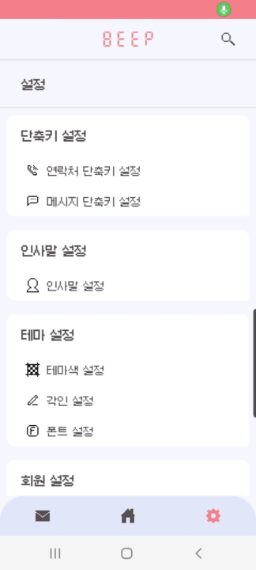
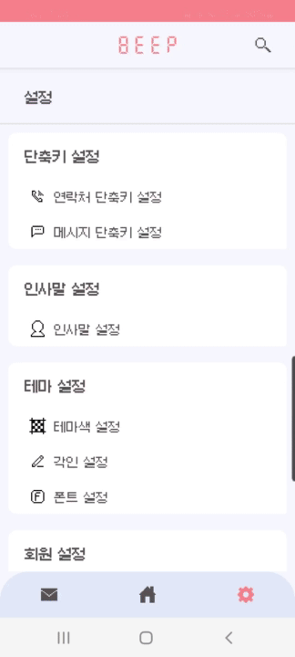
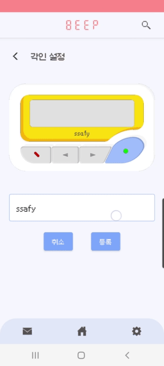
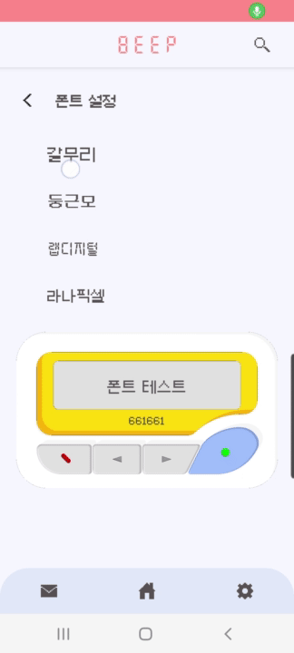

# BEEP

 

## 프로젝트 개요

- 명칭 : BEEP
- 소개 : 프로젝트는 기존의 메신저 앱들과 차별된 새로운 소통의 재미를 주기 위해 80~90년대 유행한 무선 호출기인 삐삐를 재해석해서 만든 애플리케이션입니다. 
- 진행 기간: 2022.10.10(월) ~ 2022.11.21(월)
- UCC: [Youtube 링크](https://www.youtube.com/watch?v=Zjsa6lmApLA)

 

----

 

## 팀원 소개

|                      팀장                       |                       팀원                       |                      팀원                      |                      팀원                      |                 팀원                 |
| :---------------------------------------------: | :----------------------------------------------: | :--------------------------------------------: | :--------------------------------------------: | :----------------------------------: |
|                     김현열                      |                      김태하                      |                     호인영                     |                     박예진                     |                황준원                |
|                     Android                     |                     Android                      |                    Android                     |                    Back-end                    |               Back-end               |
| 회원관리  설정 관리  디버깅  UCC | 메세지 관리  음성 녹음/재생 관리  발표 | JIRA  삐삐페이지 키보드  연락처 관리 | Redis, DB  메세지, 프리셋  차단, PPT | Security, FCM  DB, 회원, 연락처 |

 

----

 

## 기술 스택

<h3 align="center">Back-end</h3>

	
    
    
    

<h3 align="center">Android</h3>

	
    
    
    

<h3 align="center">DB</h3>

	
	
	

<h3 align="center">CI/CD</h3>

	
	
	
    

## 주요 기능

### 메시지 송/수신
<table>
    <tr>
        <td align="center">
              
            <h5>번호로 송신</h5>
        </td>
        <td align="center">
             
            <h5>인사말 듣기</h5>
        </td> 
        <td align="center">
             
            <h5>녹음 및 송신</h5>
        </td>
    </tr>
</table>

- 초성과 숫자만 사용
- 연락처 목록에서 바로 송신 가능
- 최근에 받은 메시지에서 상대에게 답장 가능
- 익명으로 송/수신 됨
- 음성을 녹음해서 메시지와 함께 송신 가능
- 음성을 녹음하기 전에 상대방의 인사말을 들을 수 있음

 

### 메시지 목록

<table>
    <tr>
        <td align="center">
              
            <h5>메시지 보관</h5>
        </td>
        <td align="center">
              
            <h5>메시지 태깅</h5>
        </td> 
        <td align="center">
              
            <h5>메시지 차단</h5>
        </td>
    </tr>
</table>

- 24시간 후에 사라짐
- 메시지 보관으로 영구 보관 가능
- 메시지에서 상대를 차단
- 음성 메시지를 재생 가능

 

### 삐삐 사전

- 예전에 삐삐에서 사용한 숫자 암호를 사전으로 구성
- 숫자 단어를 통해서 검색 가능

 

### 메시지 및 연락처 단축키

- 메시지 송신에서 번호를 길게 눌러서 사용
- 설정 화면에서 메시지, 연락처 별로 설정 가능

 

### 삐삐 꾸미기

<table>
    <tr>
        <td align="center">
            
            <h5>테마 설정</h5>
        </td>
        <td align="center">
            
            <h5>각인 설정</h5>
        </td> 
        <td align="center">
            
            <h5>폰트 설정</h5>
        </td>
    </tr>
</table>

- 메인 화면의 삐삐 색 변경 가능 (테마)
- 앱의 전체적인 폰트 변경 가능
- 삐삐에 자신만의 각인 설정 가능

## [포팅매뉴얼](exec/Readme.md)
